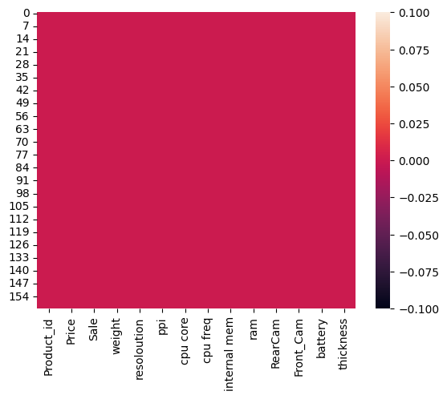
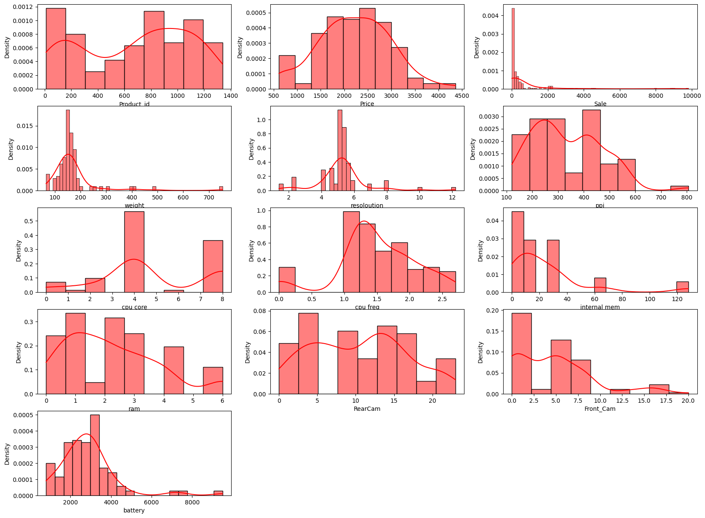
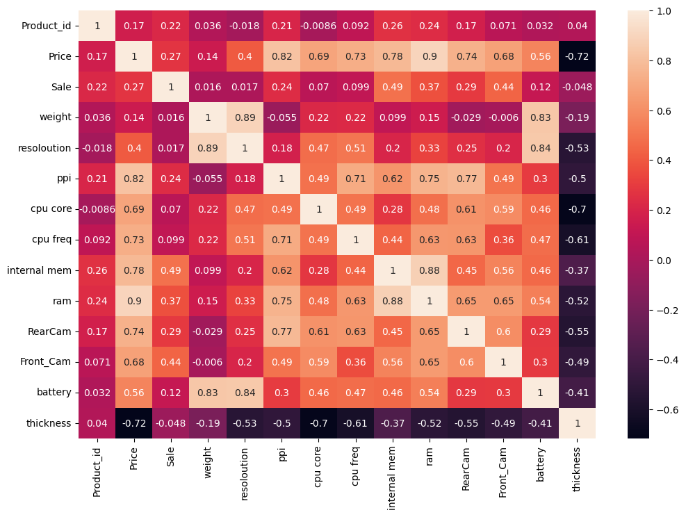
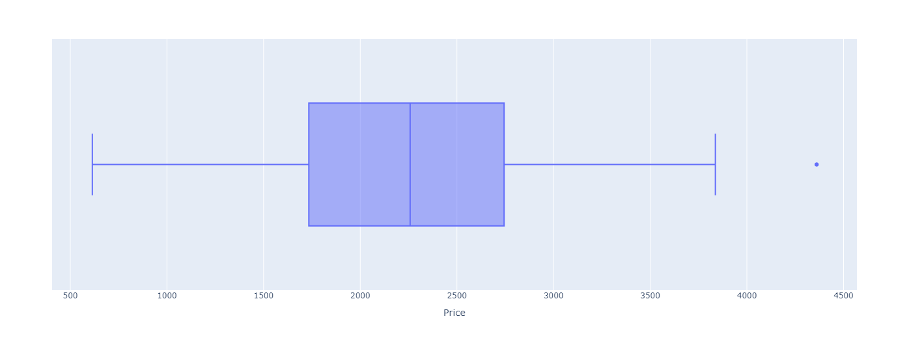
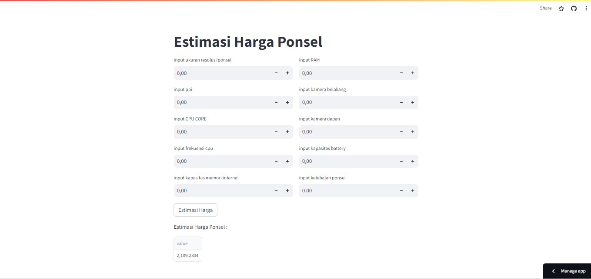

# Laporan Proyek Machine Learning
### Nama : Nisa Apriliana
### Nim : 211351102
### Kelas : Pagi A

## Domain Proyek
Di era Smartphone, para produsen ponsel seringkali dihadapkan pada situasi berapa harga Smartphone baru yang harus diluncurkan, sehingga menarik penjualan yang maksimal dan review yang positif. Analisis yang dilakukan dalam laporan ini dapat bermanfaat untuk menilai hal-hal tersebut. Berdasarkan analisis, perusahaan dapat menentukan kisaran optimal untuk meluncurkan produk dengan fitur terbaik yang diinginkan. 


## Business Understanding

Analisis ini digunakan untuk memprkirakan harga berdasarkan fitur yang ditentukan sehingga memudah produsen dalam menentukan harga ponsel.

### Problem Statements
Kemungkinan kesalahan produsen dalam penentuan harga produk yang akan diluncurkan untuk menghasilkan penjualan yang maksimal
### Goals
Mencari solusi untuk memudahkan orang dalam memperkirakan harga ponsel sesuai dengan fitur yang ada.
 
### Solution statements
 - Pengembangan Platform untuk perkiraan Harga Ponsel Berbasis Web, Solusi pertama adalah mengembangkan platform pencarian harga apartment berbasis web yang mengintegrasikan data dari Kaggle untuk memberikan pengguna akses cepat dan mudah ke informasi tentang estimasi harga ponsel. Platform ini akan menyediakan antarmuka pengguna yang ramah, memungkinkan pengguna mencari harga ponsel berdasarkan kapasitas fitur tertentu seperti ram,resolusi,memori internal,battery,kamera depan, kamera belakang.
 - Model yang dihasilkan dari datasets itu menggunakan metode Linear Regression.
## Data Understanding
Dalam proyek ini dataset yang digunakan berasal dari kaggle yang berisi data harga ponsel .Data set ini mengandung 11 kolom setelah dilakukan data cleaning
[Mobile Price Prediction](https://www.kaggle.com/datasets/mohannapd/mobile-price-prediction?rvi=1)

Adapun variabel didalam datasets ini semuanya bertype data numeric 
### Variabel-variabel pada Mobile Price Prediction adalah sebagai berikut:
- Price : merupakan harga ponsel
- resoloution : merupakan resolusi dari ponsel
- ppi         : merupakan kepadatan ponsel dalam bentuk pixel
- cpu core    : merupakan jenis inti cpu disetiap ponsel
- cpu freq    : merupakan frekuensi cpu disetiap ponsel
- internal mem : merupakan kapasitas memory internal pada ponsel
- ram : merupakan jumlah kapasitas RAM dalam bentuk GB 
- RearCam : Merupakan ukuran kamera belakang dalam bentuk MP
- Front_Cam :  Merupakan ukuran kamera depan dalam bentuk MP
- battery : merupakan kapasitas battery pada ponsel dalam bentuk mAh
- thicknees : Merupakan ketebalan ponsel


## Data Preparation
Pada bagian ini kita lakukan teknik EDA
karena kita menggunakan google colab maka langkah pertama kita hubungkan
google colab dengan kaggle 
```bash
from google.colab import files
```
Lalu mengupload token kaggle agar nanti bisa mendownload sebuah dataset dari kaggle melalui google colab
```bash
files.upload()
```
lanjut ke tahap berikutnya yaitu membuat direktori dan berikan permission 
```bash
!mkdir -p ~/.kaggle
!cp kaggle.json ~/.kaggle/
!chmod 600 ~/.kaggle/kaggle.json
!ls ~/.kaggle
```
kemudian kita panggil url dataset yang ada di website kaggle untuk 
didownload langsung ke google colab.
```bash
!kaggle datasets download -d mohannapd/mobile-price-prediction
```
kita ekstrak dataset yang sudah didownload
```bash
!mkdir mobile-price-prediction
!unzip mobile-price-prediction.zip -d mobile-price-prediction
!ls mobile-price-prediction
```
oke lanjut kita deklarasi library yang akan digunakan pada kasus ini
``` bash
import pandas as pd
import numpy as np
import matplotlib.pypot as plt
import seaborn as sns
```
pangggil dataset 
```bash
df = pd.read_csv('mobile-price-prediction/Cellphone.csv')
```
menampilkan 5 data teratas dari dataset
```bash
df.head()
```
Lalu kita cek tipe data dari masing-masing atribut/fitur dari dataset Cellphone.csv
```bash
df.info()
```
coaba kita cek nilai yang kosong dalam pada dataset ini menggunakan heatmap
```bash
sns.heatmap(df.isnull())
```

oke tidak ada yang kosong
untuk berjaga-jaga mari kita check apakah terdapat duplicate data di datasets kita,
```bash
df.duplicated()
```
cek detail informasi dari dataset ini
```bash
df.describe()
```
kita akan mengguanakan untuk subplot memvisualisasikan distribusi data dalam sebuah dataset 
```bash
plt.figure(figsize=(20,15))
j = 1
for i in df.iloc[:,:-1].columns:
    plt.subplot(5,3,j)
    sns.histplot(df[i], stat = "density", kde = True , color = "red")
    j+=1
plt.show()
```

Kita gambarkan visualisasi heatmap untuk melihat sebarand data pada dataset ini.
```bash
plt.figure(figsize=(12,8))
sns.heatmap(df.corr(),annot=True)
```

kita melihat data yang kita harapkan. Harga berkorelasi positif dengan ram, PPI (Piksel per inci), Memori internal, kamera belakang, frekuensi_cpu, inti_cpu, kamera_depan, dan baterai.

Kita perlu melihat apakah ada outlier dalam data harga
```bash
px.box(df, x='Price')
```

Terdapat outlier sehingga kita harus menghapusnya dari dataset dengan script berikut
```bash
out = list(np.where(df['Price']>3837))
out=list(out[0])

i=0
while i<len(out):
    df.drop(out[i],axis = 0, inplace=True)
    i=i+1

df.reset_index(drop=True, inplace=True)
```
lanjut kita ke tahap modeling
## Modeling
Sebelumnya mari kita import library yang akan digunakan
``` bash
    from sklearn.model_selection import train_test_split
    from sklearn.linear_model import LinearRegression
```
Langkah pertama kita lakukan seleksi fitur dengan memisahkan mana saja atribut yang akan dijadikan sebagai fitur dan atribut mana yang dijadikan label.
```bash
features=['resoloution','ppi','cpu core', 'cpu freq','internal mem','ram', 'RearCam', 'Front_Cam', 'battery', 'thickness']
x=df[features]
y=df['Price']
x.shape,y.shape
```
Pada script tersebut kita gunakan resoloution, ppi, cpu core, cpu freq,internal mem,ram, RearCam, Front_Cam, battery dan thickness sebagai fitur yang nantinya akan kita jadikan inputan. Sedangkan price kita jadikan sebagai label karena price merupakan nilai yang akan diestimasi.

Tahap berikutnya kita lakukan split data, yaitu memisahkan data training dan data testing
```bash
x_train,X_test,y_train,y_test= train_test_split(x,y,random_state=70)
y_test.shape
```
Selanjutnya kita masukan data training dan testing ke dalam model regresi linier
```bash
lr = LinearRegression()
lr.fit(x_train , y_train)
pred = lr.predict(X_test)
```
Tampilkan akurasi model regresi
```bash
score =lr.score(X_test, y_test)
print('Akurasi model regresi linier =', score)
```
wow akurasi modelnya 95.86%
Tahap berikutnya adalah kita coba model estimasi menggunakan regresi linier ini dengan inputan  data yang baru.
```bash
input_data =np.array([[5.2,424,8,1.35,16.0,3.000,13.00,8.0,2610,7.4]])
prediction =lr.predict(input_data)
print('Estimasi harga ponsel :', prediction)
```
Jika sudah berhasil jangan lupa untuk simpan model menggunakan pickle
```bash
import pickle
filename ='estimasi_ponsel.sav'
pickle.dump(lr,open(filename,'wb'))
```
## Evaluation
Pada kasus regresi ini saya menggunakan metrik evaluasi **RMSE dan R2 Score**
- RMSE merupakan salah satu cara untuk mengevaluasi model regresi linear dengan mengukur tingkat akurasi hasil perkiraan suatu model.RMSE juga merupakan kriteria penting dalam memilih model berperforma terbaik di antara model peramalan berbeda.

    Rumus :<br>
    RMSE = sqrt((1/n) * Σ|i=1|^n (y_i - ŷ_i)^2)
<br>Di mana:

    - n adalah jumlah sampel dalam data
    - y_i adalah nilai aktual
    - ŷ_i adalah nilai prediksi

- R2 SCORE merupakan suatu nilai yang memperlihatkan seberapa besar variabel independen mempengaruhi variabel dependen.

    Rumus : <br>
    R2=1−SST/SSR

    Dimana:
    - SSR adalah jumlah kuadrat regresi, yaitu jumlah dari kuadrat perbedaan antara nilai prediksi model dan nilai rata-rata dari data target.
   - SST adalah jumlah kuadrat total, yaitu jumlah dari kuadrat perbedaan antara nilai aktual dan nilai rata-rata dari data target. 
    ​
 
Setelah itu kita terapkan dalam kode sebagai berikut :
```bash
from sklearn.metrics import r2_score, mean_absolute_error
print(f"r2_score : {r2_score(y_test,pred)}")
print(f"RMSE : {np.sqrt(mean_squared_error(y_test,pred))}")
```

Dengan nilai R² yang tinggi (0.9585600980182332) dan RMSE yang rendah (160.40455466057767), ini menunjukkan bahwa model regresi Anda sangat baik dalam memprediksi data Anda dan memiliki kemampuan yang kuat untuk menjelaskan variasi dalam data. Performa model yang baik ini adalah indikasi yang positif, dan Anda dapat memiliki keyakinan dalam kemampuan model Anda untuk melakukan prediksi yang akurat.

## Deployment
[My App Estimasi Ponsel](https://stream-ponsel-mus9jfssjsjjzhoqcnnlym.streamlit.app/)


